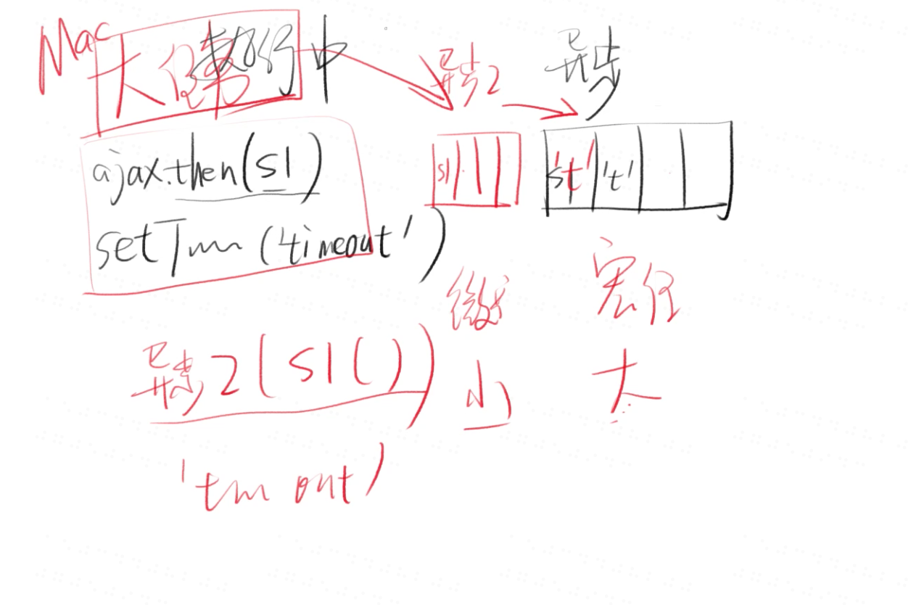
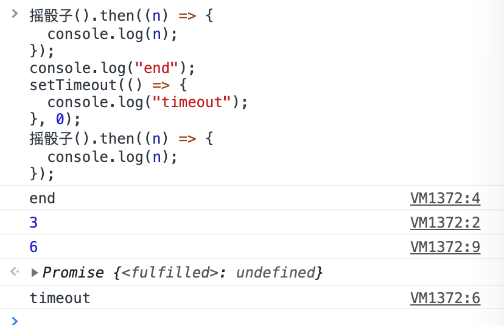
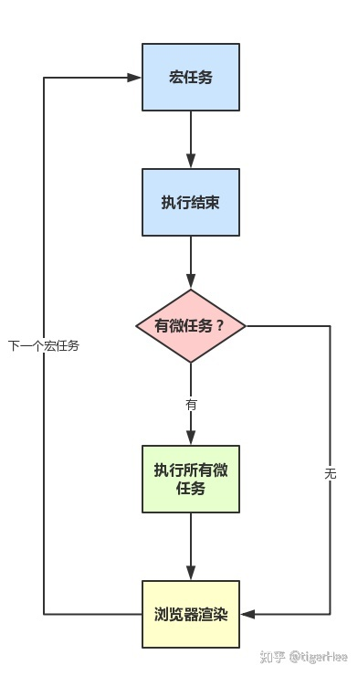
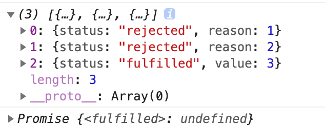

# async & await

## 基本用法

```js
const result = await promise;
```

# Promise

## Promise 的封装

```js
function 摇骰子() {
  return new Promise((resolve, reject) => {
    setTimeout(() => {
      resolve(Math.floor(Math.random() * 6) + 1);
    }, 3000);
  });
}
```

## 使用 Promise

```js
摇骰子().then(s1, f1).then(s2, f2);
```

## 一个问题

求打印顺序

```js
function 摇骰子() {
  return new Promise((resolve, reject) => {
      resolve(Math.floor(Math.random() * 6) + 1);
  });
}
摇骰子().then((n) => {
  console.log(n);
});
console.log("end");
setTimeout(() => {
  console.log("timeout");
}, 0);
/* ‘end' n(是一个数字) 'timeout' /*
```

## 宏任务与微任务



1. **promise 一般都是小任务**
2. **setTimeout 一般都是大任务**
3. 先去小任务队列执行小任务 再去大任务队列执行大任务





## why？

为了让 promise 更快执行 强行插入了一个队列 这个队列就是微(小)任务队列

## Promise 的其他 api

1. Promise.resolve(result)

   制造一个成功或失败

   ```js
   function a() {
     return Promise.resolve(4);
   }
   a().then((n) => console.log(n)); // 4
   ```

   ```js
   function b() {
     return Promise.resolve(new Promise((resolve, reject) => reject()));
   }
   b().then((n) => console.log(n)); // rejected
   ```

2. Promise.reject(reason)

   制造一个失败

   ```js
   Promise.reject("我错了").then(() => {
     console.log("success"),
       (reason) => {
         console.log("fail", reason);
       };
   });
   // Promise {<rejected>: "我错了"}
   // Uncaught (in promise) 我错了
   ```

3. Promise.all(arr)

   等待全部成功 或有一个失败

   ```js
   Promise.all([Promise.resolve(1), Promise.resolve(2)]).then((values) =>
     console.log(values)
   );
   // [1,2]
   // Promise {<fulfilled>: undefined}
   ```

   ```js
   Promise.all([Promise.reject(1), Promise.resolve(2)]).then(null, (reason) =>
     console.log(reason)
   );
   // 1
   // Promise {<fulfilled>: undefined}
   ```

4. Promise.allSettled(arr)

   执行完数组中所有的 Promise 并把他们的结果用一个数组返回

   ```js
   Promise.allSettled([
     Promise.reject(1),
     Promise.reject(2),
     Promise.resolve(3),
   ]).then((reason) => console.log(reason));
   ```

   

5. Promise.race(arr)

   等待第一个状态改变

## Promise 的应用场景

1. 多次处理一个结果

   ```js
   摇骰子()
     .then((v) => v1)
     .then((v1) => v2);
   ```

2. 串行

   假设页面中有两个按钮 A 和 B 以及一个输入框，A 点击按钮后发送一个请求，返回字符串 A。B 也发送一个请求，返回字符串 B，返回后会把字符串赋值给输入框，但是 A，B 发送的两个请求返回时间不同，点击两个按钮的时间也不确定，B 比 A 要先返回，而最终的输入框字符串顺序要求是 A B

   [范例](http://js.jirengu.com/qenaxaluta/1/edit?js,output)中的顺序不满足要求

   [解决方法](http://js.jirengu.com/bulamarofi/1/edit)

## asnyc & await 的用法

1. 最常见用法

   ```js
   const fn = async () => {
     const temp = await makePromise();
     return temp + 1;
   };
   ```

2. 封装一个 async 函数

   ```js
   async function 摇骰子() {
     return Math.floor(Math.random() * 6) + 1;
   }
   async fn(){
     const result = await 摇骰子()
   }
   ```

3. async 处理错误

   ```js
   function ajax() {
     return new Promise((resolve, reject) => {
       reject({
         response: {
           error: 403,
         },
       });
     });
   }

   function error(e) {
     console.log(e);
     throw e;
   }

   async function f1() {
     const responese = await ajax().then(null, error);
   }

   f1();
   ```

4. await 的传染性

   ```js
   console.log(1);
   await console.log(2);
   console.log(3);
   // 1 -> 2 -> 3
   ```

分析

1.  `console.log(3)` 变成了异步任务
2.  Promise 同样具有传染性(同步变异步)
3.  谁没有传染性 -> 回调
