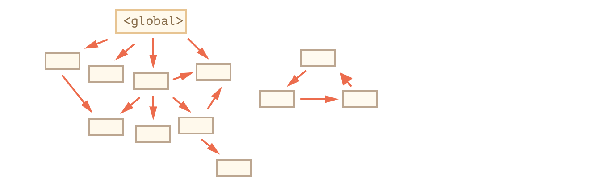
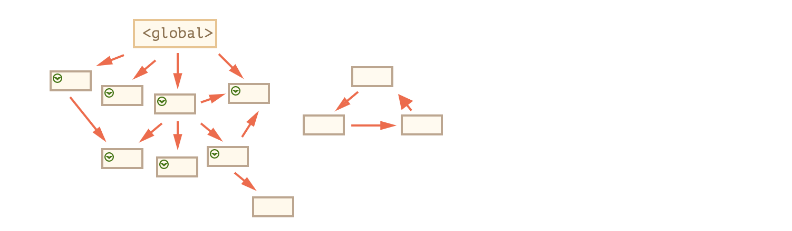
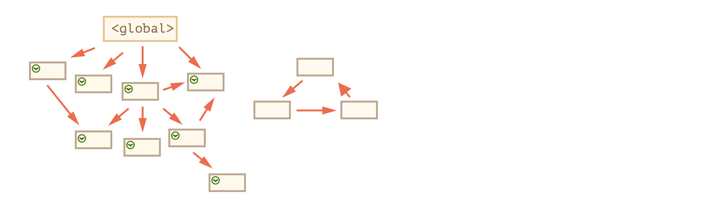
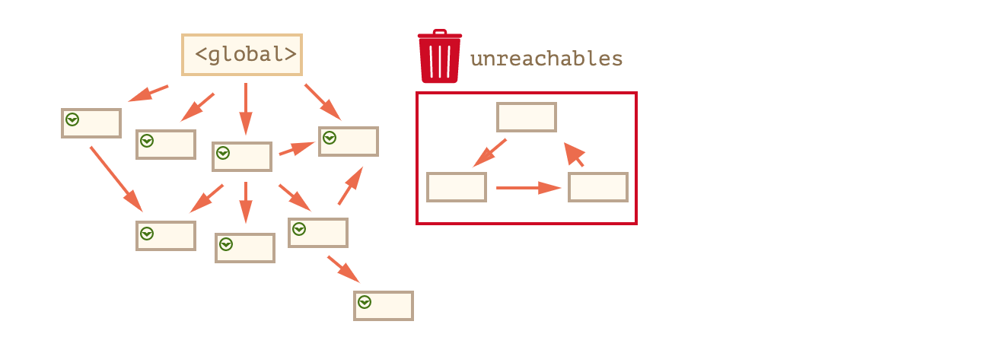

# js垃圾回收

# 什么是垃圾？

不再需要 -> 垃圾
当某个变量或引用不在被需要时，这个引用就是个垃圾

## 如何判断是不是垃圾

1. 全局变量

    ```js
    var a = 1
    ```

    a有可能被需要 所以a不是垃圾，因为有可能被使用(你有可能在任何时候用到全局变量)

    ```js
    var a = 1
    // 1000行代码
    console.log(a)
    ```

    **全局变量都不是垃圾**

2. 局部变量

    ```js
    function fn(){
        var b = 2
        console.log(b) // 2
    }
    fn() // 1
    console.log(a) //3
    ```

    **局部变量都有生命周期** 

    **当fn执行完，即走到3之后，b不会再被使用，b就是个垃圾**

3. 什么东西不能被回收


    ```js
    window -> Object,Array,Promise
    全局变量
    全局函数fn
    ```

    **因为他们是全局作用域的变量**

    ```js
    function fn(){
        var b = 2
        console.log(b)
    }
    fn()
    ```

    **当我们执行fn的时候，在fn这个作用域内会临时产生一个b，fn使用了b，fn没执行完，b不能被回收**

    ```js
    var a = {name: 'ff'} // 对象的地址是1011
    a = null // 1011没人被引用
    ```

    **因为1011没有被引用，所以是个垃圾，但是**

    ```js
    var a = {name: 'ff'} // 对象的地址是1011
    var b = a
    a = null // 1011被b引用 
    ```

    **b引用了1011 所以1011不是个垃圾**

## 垃圾回收算法






算法的缺点: 如果对象数量多，标记的开销大，并且会中断js的执行

解决方法: 

1. 把对象分为新生代和老一代，停留时间越久的，后面使用的时间也可能越久，新生代对象马上标记，马上删除

2. 分段标记，标记一部分之后，再让js执行

3. 空闲时间收集，在js执行完时进行标记


## Summary:

1. 什么是垃圾: 

    * 没有被引用的
    * 虽然有引用 但是形成了一个孤岛，也是垃圾

2. 浏览器如何找到垃圾并回收

    标记 - 清除算法 

    * 在全局作用域，把所有看到的对象进行标记
    * 如果被标记的对象引用了其他的对象，继续进行标记，一直持续到再也找不到新的对象
    * 把所有没有标记的对象都删了

