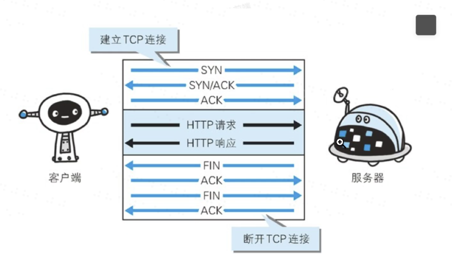
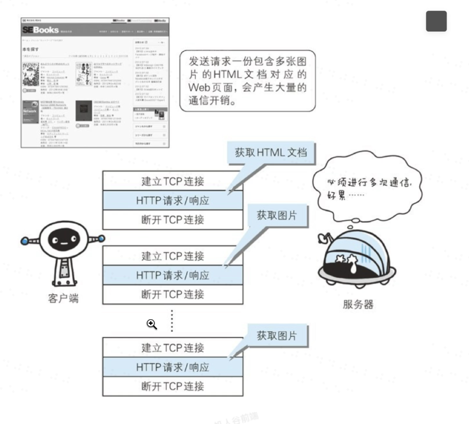
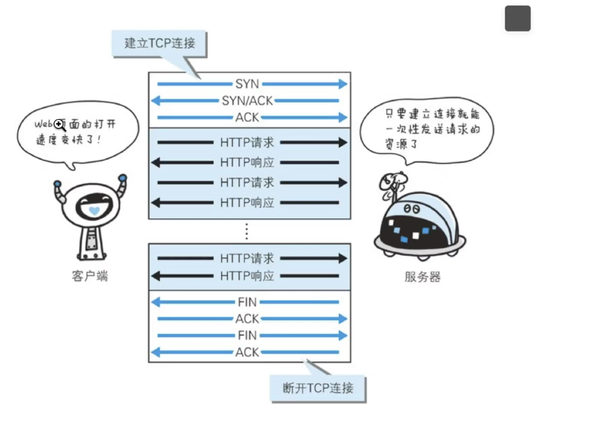
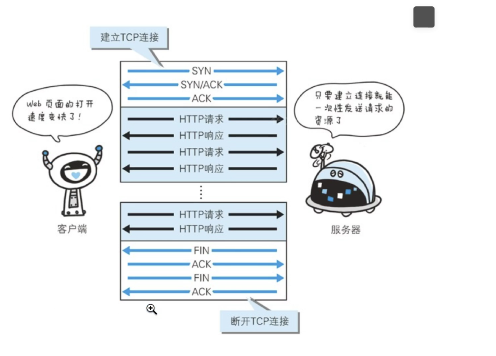
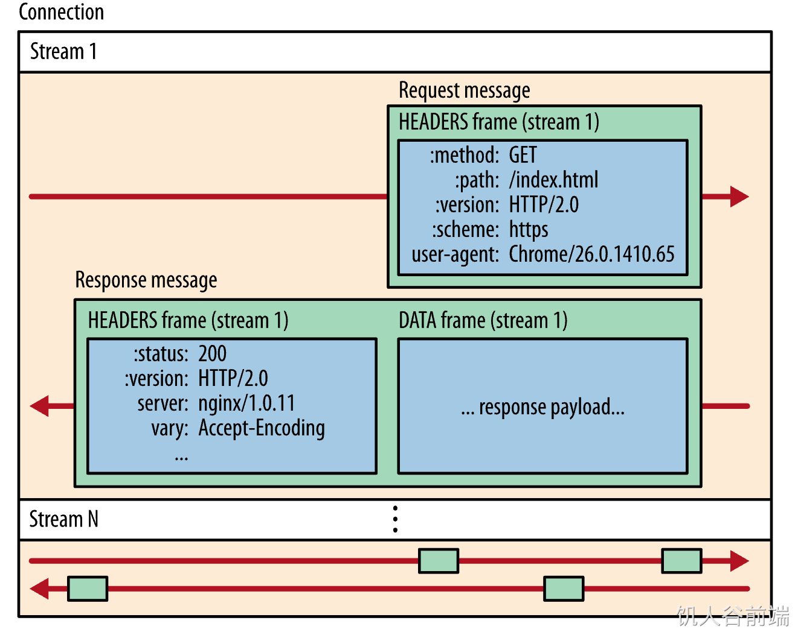
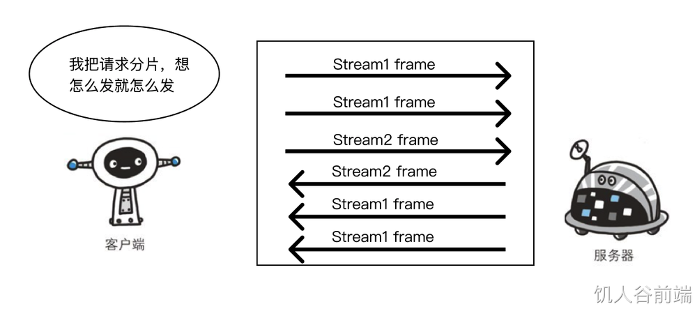

# Keep-alive 多路复用

## 一个问题

如果我们想要一次性请求多个资源会会怎么样？

这样会导致每次请求都需要建立TCP链接，会影响效率

## 改进1

我们用一次TCP链接 去发多个HTTP请求

但是请求和响应依然是串行的

## 改进2

增加流水线操作 下一个请求不必等到上一个响应来了再发送 但响应的顺序依然按照请求的顺序来(FIFO)

http1.1中默认开启，通过http请求头设置“connection: close”关闭。
http1.0默认是关闭的，通过http请求头设置“connection: keep-alive”进行开启

依旧存在的问题：
* 请求按次序，后来者需要排队等待(假设请求1是一个大图片，请求2室一个小图片，由于响应的顺序不可变，所以需要得到请求1的响应之后才能得到请求2的响应，但是请求2的响应来的比请求1早，会事实上造成请求2的响应堵塞)
* 请求头都类似，重复传输浪费资源
* 同一域名浏览器有最大并行请求限制

## HTTP 2

基于二进制流，将一个TCP分成若干个流，每个流中传若干个消息，每个消息由最小二进制帧组成，将HTTP消息分解成独立的帧，然后在另一端重新组装

* 并行交错地发送多个请求，请求之间互不影响。
* 并行交错地发送多个响应，响应之间互不干扰。
* 使用一个连接并行发送多个请求和响应。
