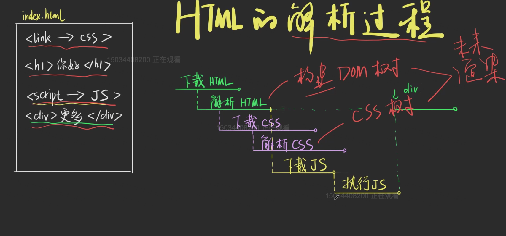
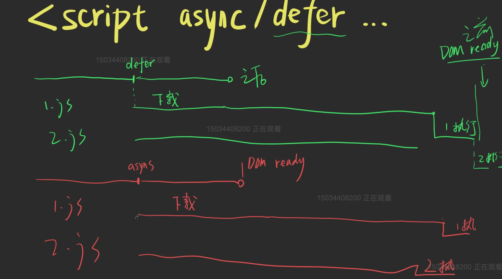
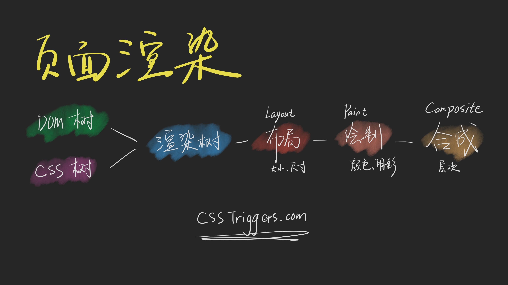

# 浏览器的渲染原理

## 浏览器的组成部分


## HTML的解析过程

1. 下载HTML，并解析HTML(浏览器根据自己的特性决定先下载还是先解析) -> 构建DOM Tree

2. 遇到CSS就同时下载CSS，并解析CSS -> 构建CSSOM Tree(这两个Tree用于后续的渲染)

3. 遇到Js要下载，执行js(**当遇到js时，HTML的解析会停止，js的下载和执行会阻塞HTML的解析**)



## 为什么js的下载会阻塞HTML的解析

因为js有可能改变HTML的结构 例如有如下的js代码

```js
document.write('<div></div>')
```

### css和js的关系

1. CSS的下载和解析会阻塞js的执行

如果不阻塞 继续解析HTML，会导致DOM Tree中少了我们新写入的这个节点，会导致DOM Tree错误

## script标签 async的和defer

**defer**

1. defer可以让HTML的解析和js的下载同时进行(不会提前)

2. js的执行会在HTML解析之后，DOM ready之前

3. 如果有多个defer一起，执行的顺序按照script标签的顺序

**async**

1. async一样会让HTML的解析和下载同时进行

2. 但是js的执行时间是未知的(可能在DOM ready之前，也可能在之后)

3. 多个js之间的执行顺序不可预测

4. 一般js与DOM毫无关系时，才会用async





## 浏览器的页面渲染

1. 页面渲染的流程

    * 拿到DOM树
    * 拿到CSS树
    * 通过DOM树和CSS树构建render Tree(渲染树)
    * 布局，计算大小，尺寸
    * 绘制，填充颜色
    * 合成 处理层次问题(重叠)



## 重排和重绘

1. 如果改变大小，尺寸 会重排 + 重绘制

2. 如果改变背景色等，一般会重绘

3. transform即不重排，也不重新绘制，只会重新合成