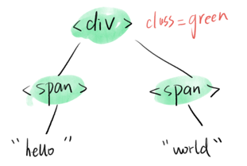
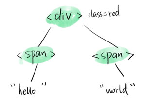
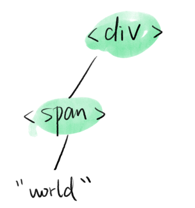
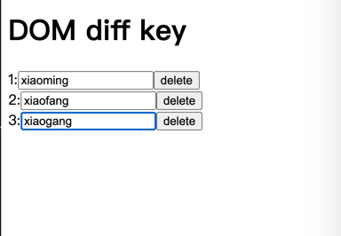
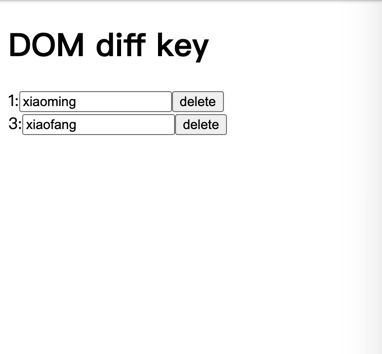

# 虚拟DOM

## 虚拟DOM是什么？

一个能代表DOM Tree的对象，通常含有标签名，标签上的属性，事件监听和子元素们，以及其他属性


   
## 虚拟DOM长什么样子？

1. React 虚拟DOM
   ```js
   const vNode = {
     key: null,
     props:{
       children: [  // 子元素
         {type: 'span',...},
         {type: 'p',...},
       ],
       className: 'my-div',  //class
       onClick: ()=>{} // 事件
     },
     ref: null, 
     type: "div",  // 标签名 or 组件名
     ...
   }
   ```
   
2. Vue 虚拟DOM

   ```js
   const vNode = {
      tag: 'div',
      data:{
        class: 'my-div',
        on: {
          click: ()=>{}
        }
      },
      children: [
        {tag: 'span',...},
        {tag: 'p',...},
      ],
      ...
   }
   ```
   
## 如何得到虚拟DOM

1. React.createElement


   ```js
   createElement('div',{
     className: 'my-div',
      onClick: ()=>{}
   },[
      createElement('span',{},'span1'),
      createElement('p',{},'p1'),
   ])
   ```

2. Vue h 函数(只能在render中调用)

```js
h('div',{
  class: 'my-div',
   on: {
     click: ()=>{}
   }
},[
  h('span',{},'span1'),
  h('p',{},'p1')
])
```

## 简便创建虚拟DOM的方法

1. React JSX

   ```js
   <div className='my-div' onclick={()=>{}}>
      <span>span1</span>
      <p>p1</p>
   </div>
   ```
   
   通过babel转变为createElement的形式

2. Vue

   ```vue
   <template>
      <div class="my-div" @click="fn">
        <span>span1</span>
        <p>p1</p>
      </div>
   </template>
   ```
   
   通过Vue-loader转变为h

## 虚拟DOM的优点

1. 减少DOM操作

   **虚拟DOM可以将多次的DOM操作合并为1次**，例如使用原生js添加1000个节点，只能1个1个添加(操作1000次DOM)，使用虚拟DOM可以变成一个长度为1000的数组，然后一次性插入这些节点(只操作1次DOM)

   **虚拟DOM借助DOM diff算法可以把多余的操作省掉**，比如在更新页面时，diff算法可以不更新那些不需要更新的DOM节点

2. 跨平台

   虚拟DOM不仅可以转译成DOM，还可以变成小程序，ios程序，android程序，因为虚拟DOM本身是一个js对象

## 虚拟DOM的缺点

   我们需要额外的函数创建DOM，比如h函数，React.createElement函数，h函数
   
   严重依赖打包工具
   
## DOM diff 算法例子

假设有如下代码

```vue
<template>
   <div :class="x">
      <span v-if='y'>hello</span>
      <span>world</span>
   </div>
</template>
```

这个结构可以用一个树来表示


### 当x从red -> green




**DOM diff算法发现div标签类型没变，只需更新div对应的dom属性，子元素没变，不更新**

### 当y从true -> false




**DOM diff发现div没变，无需更新，子元素1标签没变，但是children变了，更新children，子元素2不见了，删除对应的DOM**

## DOM diff算法

什么是DOM diff？

* 就是一个函数 我们称之为patch
* patchs = patch(oldVNode,newVNode)
* patchs就是要运行的DOM操作，可能长这样

   ```js
   [
      {type: 'INSERT',vNode: ...},
      {type: 'TEXT',vNode: ...},
      {type: 'PROPS', propsPatch: [...]},
   ]
   ```
  
DOM diff的大概逻辑

* Tree diff
   
   1. 将新旧两棵树做对比，找出哪些节点需要更新
   2. 如果节点是组件 就看Component diff
   3. 如果节点是标签 就看Element diff
    
* Component diff

    1. 如果节点是组件，就先看组件类型
    2. 类型不同直接替换，删除旧的
    3. 类型相同则只更新属性
    4. 深入组件做Tree diff(递归)
    
* Element diff

    1. 如果节点是原生标签，就看标签名
    2. 标签名不同直接替换，相同则更新属性
    3. 进入标签后代做Tree diff
    
## DOM diff的问题

同级比较会有bug

### 一个例子

[例子链接，下面的input内容请自行填入](https://stackblitz.com/edit/react-ts-c2nigw)

假设有如下页面，点击delete按钮可以删除该行，我们点击删除带有xiaofang这一行，如下所示:



本来你以为的是xiaofang这行消失了，可结果是: 



**消失的是xiaogang，what fuck**

### why？

你认为是删除了2，但是框架是这么做的

首先遍历数组[1,2,3]

发现1没变，复用之前的1和所在行的内容

发现2变成了3，就把2改成3，该行后面的内容没有改变，直接复用

发现3没了，直接把3内的元素都删除了

## 如何解决

加key就好了

[再次重复上述例子，发现问题可以解决](https://stackblitz.com/edit/react-ts-yqtajq)

### 永远不要用index作为key

如果用index作为key，在删除第二项的时候，index就会从1 2 3变成1 2，框架依然认为你删除的是第3项，依然会遇到这样的bug


