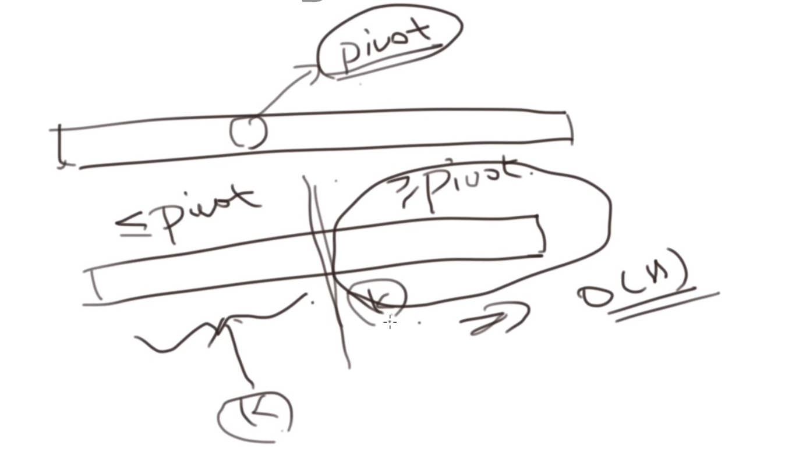
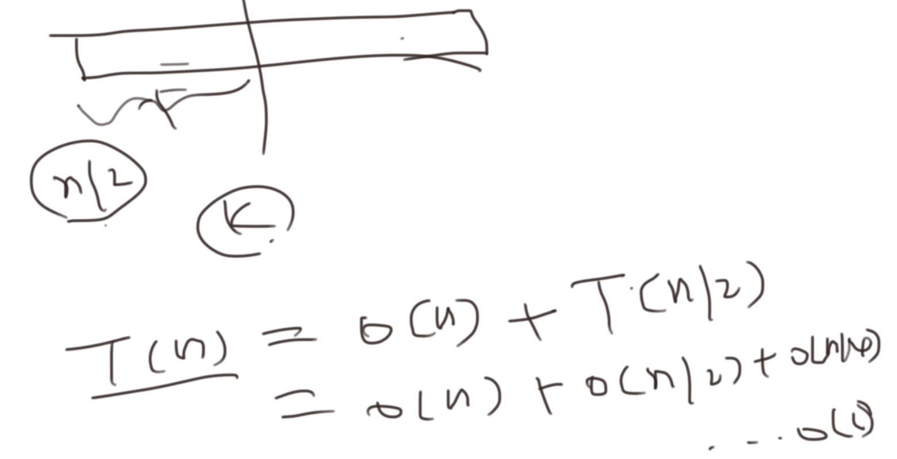

# 快速选择算法

## 基本思想

基于快速排序

1. 挑选一个基准
2. 进行一次划分
3. 看第 k 个元素落入左右哪半部分
4. 对该半部分继续





## 例题

[215. 数组中的第 K 个最大元素](https://leetcode-cn.com/problems/kth-largest-element-in-an-array/)

解:

```js
/**
 * @param {number[]} nums
 * @param {number} k
 * @return {number}
 */
var findKthLargest = function (nums, k) {
  if (!nums || nums.length === 0) {
    return -1;
  }
  return quickSelected(nums, 0, nums.length - 1, k);
};

var quickSelected = function (nums, start, end, k) {
  if (start >= end) {
    return nums[start];
  }
  let i = start,
    j = end;
  let pivot = nums[parseInt((i + j) / 2)];
  while (i <= j) {
    while (i <= j && nums[i] > pivot) {
      i++;
    }
    while (i <= j && nums[j] < pivot) {
      j--;
    }
    if (i <= j) {
      let temp = nums[i];
      nums[i] = nums[j];
      nums[j] = temp;
      i++;
      j--;
    }
  }
  if (start + k - 1 <= j) {
    return quickSelected(nums, start, j, k);
  }
  if (start + k - 1 >= i) {
    return quickSelected(nums, i, end, k - (i - start));
  }
  return nums[j + 1];
};
```
